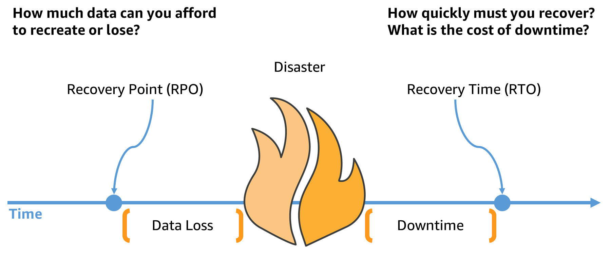

### Table of Contents
- [RTO & RPO](#rto--rpo)
- [NoSQL vs SQL](#nosql-vs-sql)
- [SLO, SLA & SLI](#slo-sla--sli)
- [Interesting things from Google SRE Book](#interesting-things-from-google-sre-book)

---

#### RTO  &  RPO {#rto--rpo}

RTO stands for Recovery Time Objective, it means after a disaster in a database how long it will take to recover and restore availability of the database/application.

RPO stands for Recovery Point Objective, it means how much data loss is acceptable for the application.

#### 

Both RPO & RTO are measured in TIME (hours, minutes, seconds). Lower numbers indicate less data loss or downtime. Having lower numbers results in more complexity & operating costs.

> source referred - https://aws.amazon.com/blogs/mt/establishing-rpo-and-rto-targets-for-cloud-applications/

---

### NoSQL vs SQL {#nosql-vs-sql} 

| NoSQL                                                        | SQL                                                     |
| ------------------------------------------------------------ | ------------------------------------------------------- |
| works well with semi-structured & unstructured data          | works only with structured data                         |
| scales horizontally                                          | scales vertically                                       |
| documents, key-value pairs, graph structures                 | Table Based                                             |
| use JSON (JavaScript Object Notation), XML, YAML, or binary schema | use SQL (Structured Query Language)                     |
| schema-less (no fixed data model)                            | fixed-defined schema                                    |
| support options may be limited (Newer technology)            | Higher Community Support  (well established technology) |

> source referred - https://www.coursera.org/in/articles/nosql-vs-sql

---

### SLO, SLA & SLI {#slo-sla--sli}

1. **SLI (Service Level Indicator)** - the actual metric being measured, e.g., uptime, latency, error rate.
2. **SLO (Service Level Objective)** - the target/goal set for that metric, e.g., 99.9% uptime.
3. **SLA (Service Level Agreement)** - the formal contract between provider & customer, defines consequences if SLO is not met.

#### Interesting things from Google SRE Book {#interesting-things-from-google-sre-book}

- **Most people say "SLA" but mean "SLO"** — if someone says "SLA violation," they almost always mean a missed SLO. A real SLA violation could trigger a court case.

- **Error Budget** — SLOs shouldn't be met 100% of the time. Teams get an "error budget" — an allowed rate of failure. This balances reliability with the speed of shipping new features.

- **Averages lie** — a typical request may take 50ms, but 5% of requests can be 20x slower. Averages hide tail latency. Google recommends using **percentiles** (e.g., 99th percentile) instead.

- **Don't overachieve** — if your service consistently performs better than the stated SLO, users start relying on that higher performance. Google's Chubby lock service was so reliable that teams forgot it could go down — so Google started scheduling intentional outages to reset expectations.

- **Availability is expressed in "nines"** — 99% = "2 nines", 99.9% = "3 nines", 99.999% = "5 nines". Google Compute Engine targets "three and a half nines" (99.95%).

> source referred - https://sre.google/sre-book/service-level-objectives/

---
